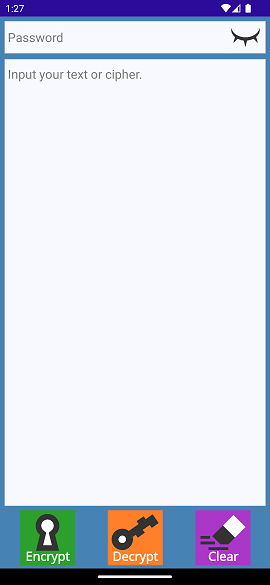

# What is QDCrypt?

  QDCrypt or Quick and Dirty Encryption is an open-source application made to encrypt words, phrases or sentences. It is a simple and easy-to-use tool that can be used by anyone. The application uses the Advanced Encryption Standard (AES) algorithm to encrypt data.

